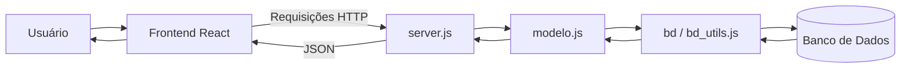
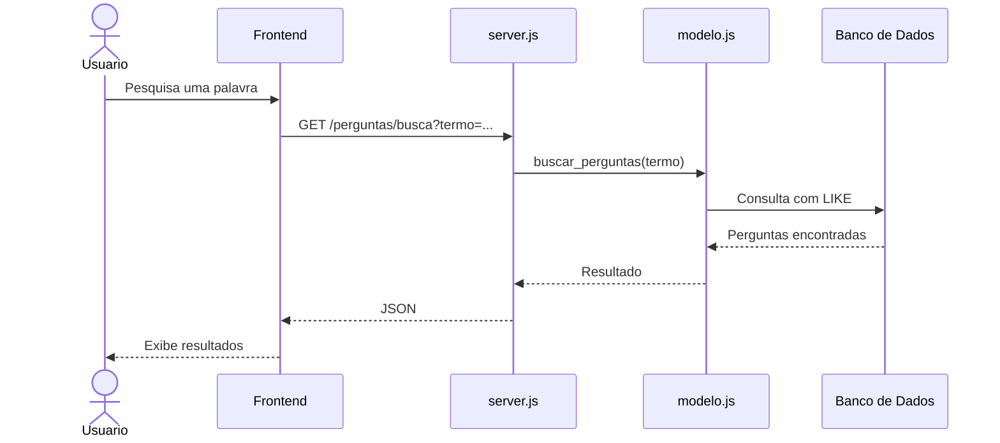

# Arquitetura Atual do ESM Forum

## Introdução

O ESM Forum possui uma arquitetura simples, adequada ao escopo atual da aplicação. O sistema é dividido principalmente entre uma aplicação frontend, responsável pela interação com o usuário, e uma aplicação backend, responsável por disponibilizar os dados e operações do fórum.

No backend analisado, os principais componentes estão concentrados nos arquivos `server.js`, `modelo.js` e nos módulos de acesso ao banco de dados presentes no diretório `bd`.

A estrutura pode ser compreendida como uma arquitetura em camadas simplificada.

## Visão geral da arquitetura

O fluxo principal da aplicação pode ser representado da seguinte maneira:



Cada parte possui uma função diferente dentro do sistema.

## Camada de apresentação

A camada de apresentação corresponde ao frontend da aplicação.

Ela é responsável por apresentar a interface do fórum ao usuário e realizar requisições ao backend para obter ou enviar informações.

Dessa forma, o usuário não acessa diretamente o banco de dados ou as funções internas do backend.

## Camada HTTP

No backend, o arquivo `server.js` funciona como ponto de entrada das requisições HTTP.

O Express é utilizado para configurar o servidor e definir as rotas disponíveis.

Exemplo:

```javascript
app.get('/', (req, res) => {
  try {
    const perguntas = modelo.listar_perguntas();
    res.send(perguntas);
  }
  catch(erro) {
    res.status(500).json(erro.message);
  }
});
```

Essa camada recebe a requisição, utiliza as operações disponibilizadas pelo modelo e envia uma resposta ao cliente.

A funcionalidade de busca implementada no projeto também segue essa estrutura:

```javascript
app.get('/perguntas/busca', (req, res) => {
  try {
    const termo = req.query.termo || '';
    const perguntas = modelo.buscar_perguntas(termo);
    res.json(perguntas);
  }
  catch(erro) {
    res.status(500).json(erro.message);
  }
});
```

## Camada de modelo e acesso aos dados

O arquivo `modelo.js` concentra as operações relacionadas às perguntas e respostas.

Entre suas responsabilidades estão:

- listar perguntas;
- cadastrar perguntas;
- cadastrar respostas;
- localizar uma pergunta;
- buscar respostas;
- calcular a quantidade de respostas;
- buscar perguntas por palavra-chave.

Um exemplo de acesso aos dados é:

```javascript
function get_pergunta(id_pergunta) {
  return bd.query(
    'select * from perguntas where id_pergunta = ?',
    [id_pergunta]
  );
}
```

O modelo utiliza as funções disponibilizadas pelo módulo de banco de dados para executar as consultas necessárias.

## Camada de persistência

Os módulos localizados no diretório `bd` são responsáveis pela comunicação com o banco de dados.

O `modelo.js` utiliza essa dependência por meio de:

```javascript
var bd = require('./bd/bd_utils.js');
```

Dessa forma, as rotas do `server.js` não precisam executar diretamente as consultas SQL.

O projeto também permite substituir essa dependência durante os testes utilizando a função `reconfig_bd`, o que facilita a utilização de um banco simulado.

## Comunicação entre os componentes

De forma simplificada, uma operação segue este fluxo:

1. O usuário executa uma ação no frontend.
2. O frontend envia uma requisição HTTP ao backend.
3. O `server.js` identifica a rota correspondente.
4. A rota chama uma função do `modelo.js`.
5. O modelo utiliza o módulo de banco de dados.
6. O resultado retorna ao `server.js`.
7. O servidor envia a resposta ao frontend, normalmente em JSON.
8. O frontend apresenta o resultado ao usuário.

## Exemplo: busca por palavra-chave

A funcionalidade de busca implementada durante o projeto segue o mesmo fluxo arquitetural.



## Pontos positivos da arquitetura atual

A arquitetura atual possui algumas vantagens para uma aplicação de pequeno porte.

A separação entre frontend e backend permite que a interface e o servidor sejam desenvolvidos de forma independente.

No backend, existe uma separação básica entre o tratamento das requisições HTTP e o acesso aos dados. O `server.js` utiliza as funções disponibilizadas pelo `modelo.js`, evitando que as consultas SQL sejam escritas diretamente em cada rota.

A estrutura também é relativamente simples de compreender e executar.

## Limitações da arquitetura atual

Apesar de funcionar para o escopo atual, a arquitetura apresenta limitações que podem se tornar mais relevantes conforme o sistema crescer.

O arquivo `server.js` concentra todas as rotas da aplicação. Com a inclusão de novas funcionalidades, esse arquivo pode aumentar consideravelmente.

Da mesma forma, o `modelo.js` concentra operações relacionadas a diferentes entidades, como perguntas e respostas.

Também não existe atualmente uma camada de serviço específica para concentrar regras de negócio entre as rotas e o acesso aos dados.

Essas características podem aumentar o acoplamento e dificultar a manutenção caso o número de funcionalidades cresça significativamente.

## Conclusão

A arquitetura atual do ESM Forum pode ser caracterizada como uma estrutura em camadas simplificada, formada pela interface frontend, pelas rotas HTTP do backend, pelo modelo e pelo acesso ao banco de dados.

Essa organização atende às necessidades atuais do sistema e mantém o projeto relativamente simples. Entretanto, funcionalidades adicionais podem aumentar as responsabilidades dos arquivos existentes, tornando interessante uma evolução arquitetural que aumente a modularidade e a separação de responsabilidades.