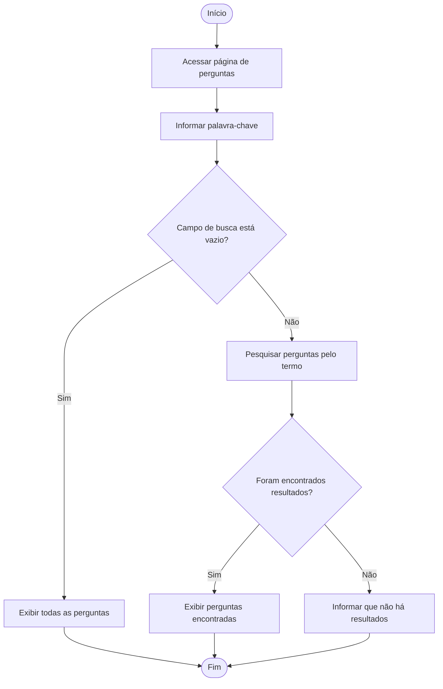

# Diagrama de Atividade

O diagrama de atividade abaixo representa o fluxo da busca de perguntas por palavra-chave no ESM Forum.

## Descrição

O processo começa quando o usuário acessa a página de perguntas e informa uma palavra-chave. Caso o campo de busca esteja vazio, o sistema mantém a exibição das perguntas sem aplicar um filtro. Caso exista um termo de pesquisa, o sistema realiza a busca e verifica se foram encontrados resultados. Quando existem correspondências, as perguntas encontradas são exibidas. Caso contrário, o usuário é informado de que não existem resultados para a pesquisa.