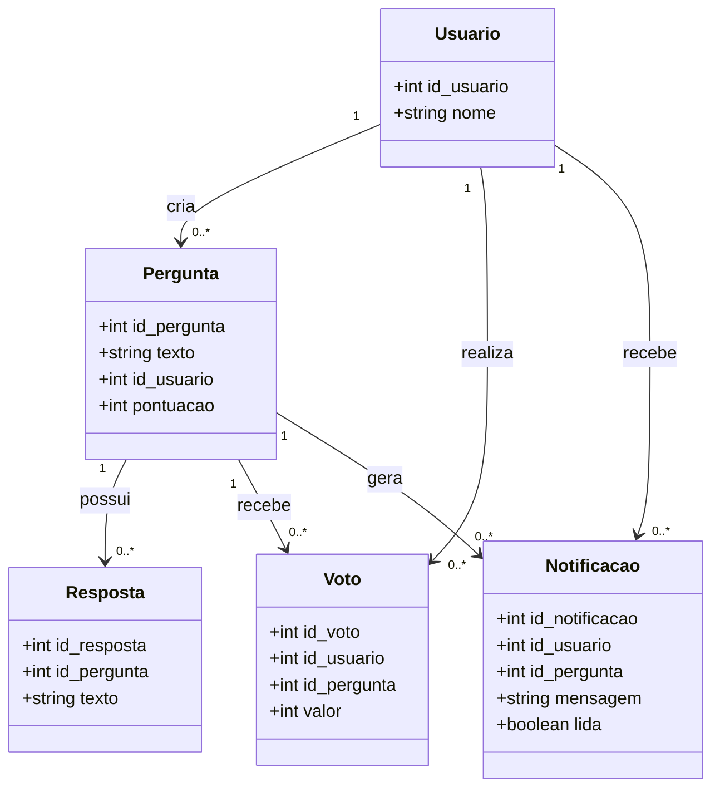

# Diagrama de Classes

O diagrama abaixo representa as principais classes envolvidas nas funcionalidades selecionadas para a evolução do ESM Forum.

## Descrição

O usuário pode criar perguntas e realizar votos. Cada pergunta pode possuir várias respostas e receber vários votos. Quando uma nova resposta é adicionada a uma pergunta, uma notificação pode ser gerada para o autor da pergunta.

A funcionalidade de busca utiliza o conteúdo das perguntas existentes para localizar aquelas que correspondem à palavra-chave informada pelo usuário, não sendo necessária a criação de uma classe específica apenas para representar a busca.