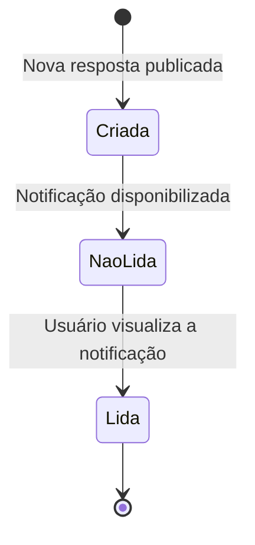

# Diagrama de Estados

O diagrama de estados abaixo representa o ciclo de vida de uma notificação no ESM Forum.

## Descrição

Quando uma nova resposta é publicada em uma pergunta, o sistema cria uma notificação destinada ao autor da pergunta. Após ser disponibilizada, a notificação permanece no estado de não lida até que o usuário a visualize. Depois da visualização, seu estado é alterado para lida, encerrando o fluxo representado no diagrama.