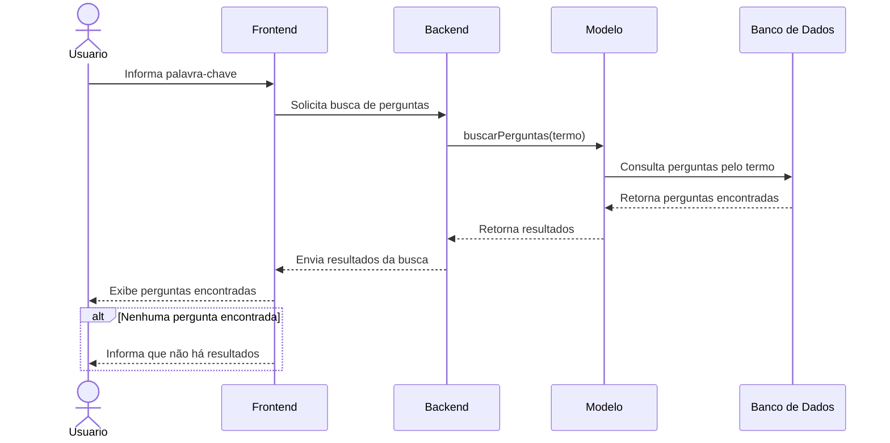

# Diagrama de Sequência

O diagrama de sequência abaixo representa o processo de busca de perguntas por palavra-chave no ESM Forum.

## Descrição

O usuário informa uma palavra-chave no frontend, que envia a solicitação de busca ao backend. O backend utiliza o modelo para consultar as perguntas armazenadas no banco de dados. Os resultados são retornados ao frontend e apresentados ao usuário. Caso nenhuma pergunta corresponda ao termo pesquisado, o sistema informa que não foram encontrados resultados.