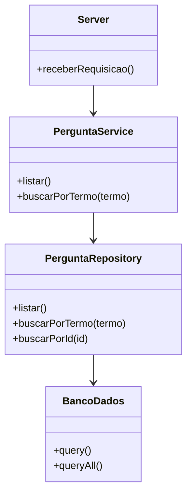
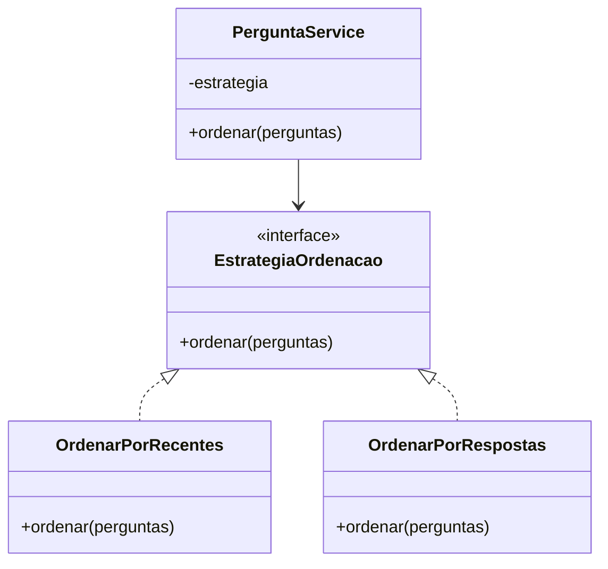
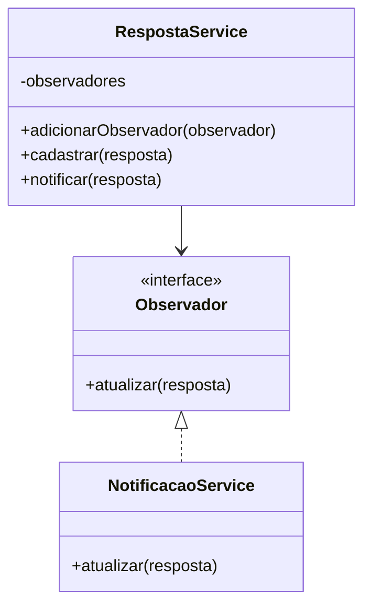

# Padrões de Projeto Propostos

## Introdução

O ESM Forum possui uma estrutura simples, adequada ao tamanho atual da aplicação. Entretanto, com a inclusão de novas funcionalidades, como busca, votação, categorização, perfis e notificações, algumas responsabilidades podem crescer e tornar o sistema mais difícil de manter.

Por esse motivo, são propostos três padrões de projeto que podem contribuir para a evolução da aplicação:

1. Repository
2. Strategy
3. Observer

Cada padrão atende a um problema diferente e pode ser introduzido gradualmente conforme novas funcionalidades forem desenvolvidas.

---

## 1. Repository Pattern

### Problema

Atualmente, o arquivo `modelo.js` contém diretamente consultas SQL relacionadas às perguntas e respostas.

Exemplo:

```javascript
function get_pergunta(id_pergunta) {
  return bd.query(
    'select * from perguntas where id_pergunta = ?',
    [id_pergunta]
  );
}
```

Com o crescimento do sistema, a quantidade de consultas pode aumentar consideravelmente, concentrando muitas responsabilidades no mesmo módulo.

### Proposta

O **Repository Pattern** pode ser utilizado para criar módulos específicos responsáveis pelo acesso aos dados.

Por exemplo, poderia ser criado um `PerguntaRepository`, responsável somente pelas operações relacionadas às perguntas.

```javascript
class PerguntaRepository {
  constructor(bd) {
    this.bd = bd;
  }

  listar() {
    return this.bd.queryAll(
      'select * from perguntas',
      []
    );
  }

  buscarPorTermo(termo) {
    return this.bd.queryAll(
      'select * from perguntas where texto like ?',
      [`%${termo}%`]
    );
  }

  buscarPorId(id) {
    return this.bd.query(
      'select * from perguntas where id_pergunta = ?',
      [id]
    );
  }
}
```

### Benefícios

A utilização desse padrão permitiria:

- concentrar as consultas relacionadas às perguntas em um único componente;
- reduzir a quantidade de código de persistência no modelo;
- facilitar a substituição do banco de dados;
- facilitar a criação de testes utilizando implementações simuladas;
- melhorar a organização conforme novas funcionalidades forem adicionadas.

### Diagrama



---

## 2. Strategy Pattern

### Problema

Com a evolução do fórum, podem existir diferentes maneiras de ordenar ou filtrar perguntas.

Por exemplo, o sistema pode permitir:

- perguntas mais recentes;
- perguntas mais votadas;
- perguntas com maior quantidade de respostas.

Colocar todas essas regras diretamente em uma única função poderia gerar muitos blocos condicionais e dificultar futuras alterações.

### Proposta

O **Strategy Pattern** permite representar cada forma de ordenação como uma estratégia independente.

Um exemplo simplificado seria:

```javascript
class OrdenarPorRecentes {
  ordenar(perguntas) {
    return perguntas.sort(
      (a, b) => b.id_pergunta - a.id_pergunta
    );
  }
}

class OrdenarPorRespostas {
  ordenar(perguntas) {
    return perguntas.sort(
      (a, b) => b.num_respostas - a.num_respostas
    );
  }
}

class PerguntaService {
  constructor(estrategia) {
    this.estrategia = estrategia;
  }

  ordenar(perguntas) {
    return this.estrategia.ordenar(perguntas);
  }
}
```

Uma estratégia diferente poderia ser fornecida ao serviço dependendo da opção escolhida pelo usuário.

### Benefícios

O Strategy permitiria:

- adicionar novas formas de ordenação sem alterar todas as estratégias existentes;
- evitar grandes estruturas condicionais;
- separar cada regra de ordenação;
- facilitar testes individuais;
- favorecer o princípio Open/Closed.

### Diagrama



---

## 3. Observer Pattern

### Problema

Uma das funcionalidades previstas para evolução do ESM Forum é a criação de **notificações quando uma pergunta do usuário receber uma nova resposta**.

Sem uma separação adequada, o cadastro da resposta poderia ficar diretamente responsável por várias ações, como salvar a resposta, localizar o autor da pergunta e criar a notificação.

Isso aumentaria o acoplamento da funcionalidade.

### Proposta

O **Observer Pattern** pode ser utilizado para permitir que componentes interessados sejam avisados quando determinados eventos ocorrerem.

Quando uma nova resposta for cadastrada, um evento pode ser disparado. O serviço de notificações, atuando como observador, pode receber esse evento e gerar a notificação para o autor da pergunta.

Exemplo simplificado:

```javascript
class RespostaService {
  constructor() {
    this.observadores = [];
  }

  adicionarObservador(observador) {
    this.observadores.push(observador);
  }

  notificar(resposta) {
    this.observadores.forEach(observador => {
      observador.atualizar(resposta);
    });
  }

  cadastrar(resposta) {
    // salva a resposta
    this.notificar(resposta);
  }
}

class NotificacaoService {
  atualizar(resposta) {
    console.log(
      `Nova resposta cadastrada na pergunta ${resposta.id_pergunta}`
    );
  }
}
```

### Benefícios

O Observer permitiria:

- diminuir o acoplamento entre respostas e notificações;
- adicionar outros observadores futuramente;
- manter o cadastro da resposta separado das ações executadas depois dele;
- facilitar a expansão do sistema.

Além das notificações, futuramente outros componentes poderiam reagir ao mesmo evento sem modificar diretamente a lógica de cadastro da resposta.

### Diagrama



---

## Comparação das propostas

Os três padrões possuem objetivos diferentes dentro da aplicação.

O **Repository Pattern** é voltado principalmente para a organização do acesso aos dados e pode melhorar a separação entre regras da aplicação e consultas ao banco.

O **Strategy Pattern** é adequado para situações em que existem diferentes formas de executar uma mesma operação, como ordenar ou filtrar perguntas.

O **Observer Pattern** é especialmente útil para funcionalidades orientadas a eventos, como a notificação de usuários quando novas respostas forem cadastradas.

Esses padrões não precisam ser implementados simultaneamente. Eles representam possibilidades de evolução da arquitetura conforme o sistema aumentar em tamanho e complexidade.

## Conclusão

A adoção gradual de Repository, Strategy e Observer pode contribuir para uma estrutura mais modular e extensível no ESM Forum.

As propostas procuram resolver necessidades relacionadas às funcionalidades previstas para o sistema sem exigir uma reconstrução completa da aplicação. Dessa forma, os padrões podem ser incorporados conforme novas necessidades surgirem durante a evolução do projeto.