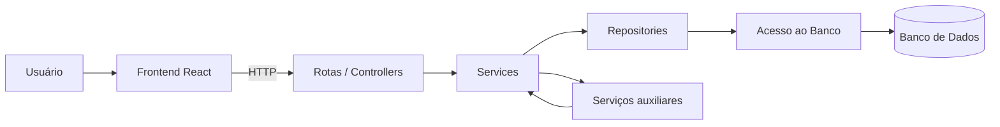
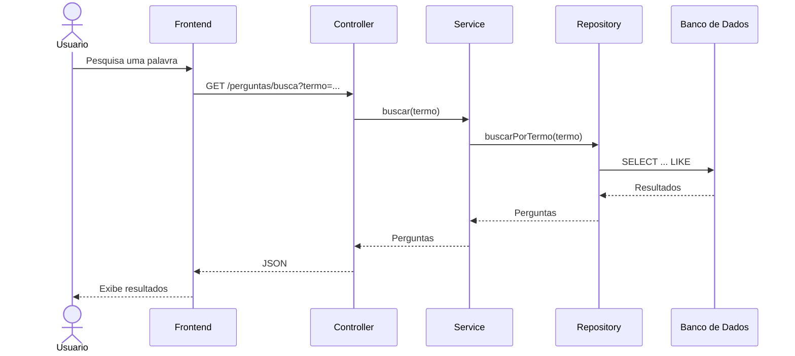
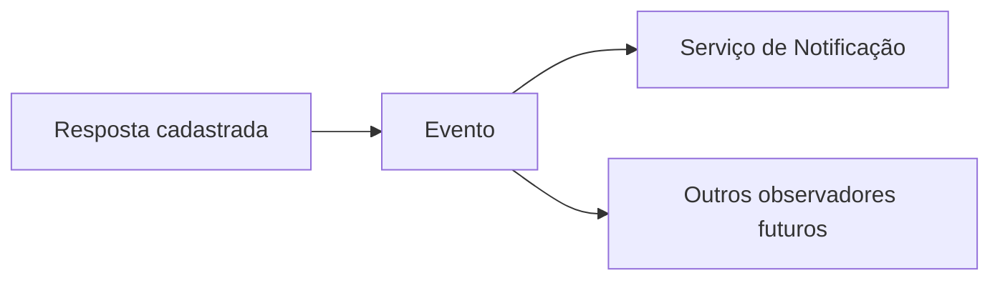

# Proposta de Evolução da Arquitetura

## Introdução

A arquitetura atual do ESM Forum atende ao escopo atual da aplicação, mas concentra uma quantidade significativa de responsabilidades nos arquivos `server.js` e `modelo.js`.

Com a inclusão de novas funcionalidades, como busca, votação, categorização, perfil de usuário e notificações, essa estrutura pode se tornar mais difícil de manter.

Por esse motivo, é proposta uma evolução gradual para uma arquitetura em camadas mais bem definidas, separando rotas, serviços, repositórios e acesso ao banco de dados.

## Arquitetura proposta

A estrutura proposta pode ser representada da seguinte forma:



O objetivo não é reconstruir completamente o sistema, mas reorganizar gradualmente suas responsabilidades conforme novas funcionalidades forem adicionadas.

## 1. Camada de apresentação

O frontend React continuaria responsável pela interação com o usuário.

Entre suas responsabilidades estariam:

- exibir perguntas e respostas;
- permitir a criação de perguntas;
- permitir o envio de respostas;
- realizar pesquisas;
- exibir votos, categorias e notificações;
- enviar requisições HTTP ao backend.

O frontend não teria acesso direto às regras internas ou ao banco de dados.

## 2. Rotas e Controllers

Atualmente, as rotas estão concentradas no arquivo `server.js`.

Na arquitetura proposta, elas poderiam ser separadas de acordo com os recursos da aplicação.

Uma possível organização seria:

```text
routes/
  perguntas.js
  respostas.js
  usuarios.js
  notificacoes.js
```

Os controllers ou handlers dessas rotas seriam responsáveis principalmente por:

- receber os dados da requisição;
- validar informações básicas;
- chamar o serviço adequado;
- definir o código HTTP;
- retornar a resposta ao cliente.

Por exemplo:

```javascript
router.get('/busca', (req, res) => {
  try {
    const termo = req.query.termo || '';
    const perguntas = perguntaService.buscar(termo);
    res.json(perguntas);
  }
  catch (erro) {
    res.status(500).json(erro.message);
  }
});
```

Dessa maneira, as regras da aplicação não precisariam ficar diretamente nas rotas.

## 3. Camada de serviços

Uma camada de serviços poderia ser adicionada entre as rotas e os repositórios.

Essa camada seria responsável pelas regras de negócio da aplicação.

Uma possível estrutura seria:

```text
services/
  perguntaService.js
  respostaService.js
  notificacaoService.js
```

Por exemplo:

```javascript
class PerguntaService {
  constructor(perguntaRepository) {
    this.perguntaRepository = perguntaRepository;
  }

  buscar(termo) {
    return this.perguntaRepository.buscarPorTermo(termo);
  }
}
```

Com essa separação, as rotas ficam concentradas na comunicação HTTP e os serviços ficam responsáveis pelo comportamento da aplicação.

## 4. Camada de repositórios

O acesso aos dados poderia ser separado utilizando o Repository Pattern.

Uma possível estrutura seria:

```text
repositories/
  perguntaRepository.js
  respostaRepository.js
  usuarioRepository.js
  notificacaoRepository.js
```

Por exemplo:

```javascript
class PerguntaRepository {
  constructor(bd) {
    this.bd = bd;
  }

  buscarPorTermo(termo) {
    return this.bd.queryAll(
      'select * from perguntas where texto like ?',
      [`%${termo}%`]
    );
  }
}
```

Assim, consultas SQL relacionadas às perguntas ficariam concentradas em um componente específico.

## 5. Camada de persistência

Os módulos responsáveis pela comunicação direta com o banco de dados continuariam isolados na parte inferior da arquitetura.

Os repositórios utilizariam essa camada para executar consultas, enquanto serviços e rotas não precisariam conhecer os detalhes de implementação do banco.

Essa organização também facilitaria a substituição da dependência por mocks durante os testes.

## Fluxo de uma requisição

Na arquitetura proposta, uma busca por palavra-chave poderia seguir o seguinte fluxo:



## Aplicação dos padrões propostos

A evolução arquitetural também permite utilizar os padrões apresentados em `PADROES_PROPOSTOS.md`.

### Repository

O Repository seria utilizado na camada de persistência para separar as consultas ao banco das regras de negócio.

### Strategy

O Strategy poderia ser utilizado dentro dos serviços para selecionar diferentes formas de ordenação ou filtragem das perguntas.

Por exemplo:

```text
PerguntaService
      |
      v
EstrategiaOrdenacao
   /          \
Recentes    MaisRespondidas
```

Novas estratégias poderiam ser adicionadas sem modificar as existentes.

### Observer

O Observer poderia ser utilizado principalmente no sistema de notificações.

Quando uma resposta fosse cadastrada, os componentes interessados poderiam ser notificados.



Dessa forma, o cadastro de uma resposta não precisaria conhecer diretamente todas as ações que podem acontecer depois dela.

## Estrutura de diretórios proposta

Uma possível organização futura do backend seria:

```text
esmforum/
│
├── routes/
│   ├── perguntas.js
│   ├── respostas.js
│   ├── usuarios.js
│   └── notificacoes.js
│
├── services/
│   ├── perguntaService.js
│   ├── respostaService.js
│   └── notificacaoService.js
│
├── repositories/
│   ├── perguntaRepository.js
│   ├── respostaRepository.js
│   ├── usuarioRepository.js
│   └── notificacaoRepository.js
│
├── strategies/
│   ├── ordenarPorRecentes.js
│   └── ordenarPorRespostas.js
│
├── bd/
│   └── bd_utils.js
│
└── server.js
```

Essa estrutura é apenas uma proposta de evolução. Não seria necessário criar todas essas pastas imediatamente.

## Benefícios da proposta

A evolução arquitetural proposta pode trazer benefícios como:

- melhor separação de responsabilidades;
- menor acoplamento entre as partes do sistema;
- maior facilidade para realizar testes;
- organização das consultas ao banco;
- facilidade para adicionar novas funcionalidades;
- melhor manutenção do código;
- possibilidade de substituir componentes sem modificar grande parte da aplicação.

## Migração gradual

A mudança não precisaria acontecer de uma única vez.

Uma estratégia possível seria migrar o sistema gradualmente:

1. separar as rotas do `server.js`;
2. criar repositórios para perguntas e respostas;
3. introduzir uma camada de serviços;
4. migrar as regras existentes para os serviços;
5. adicionar Strategy quando diferentes formas de ordenação forem necessárias;
6. utilizar Observer quando o sistema de notificações for implementado.

Essa abordagem reduz o risco de alterar muitas partes do sistema simultaneamente.

## Conclusão

A proposta mantém a arquitetura atual como ponto de partida, mas introduz uma separação mais clara entre apresentação, rotas, serviços, repositórios e persistência.

Essa evolução permitiria que o ESM Forum crescesse de maneira mais organizada conforme novas funcionalidades fossem adicionadas. Os padrões Repository, Strategy e Observer complementariam essa arquitetura, oferecendo soluções específicas para acesso aos dados, variações de comportamento e comunicação orientada a eventos.